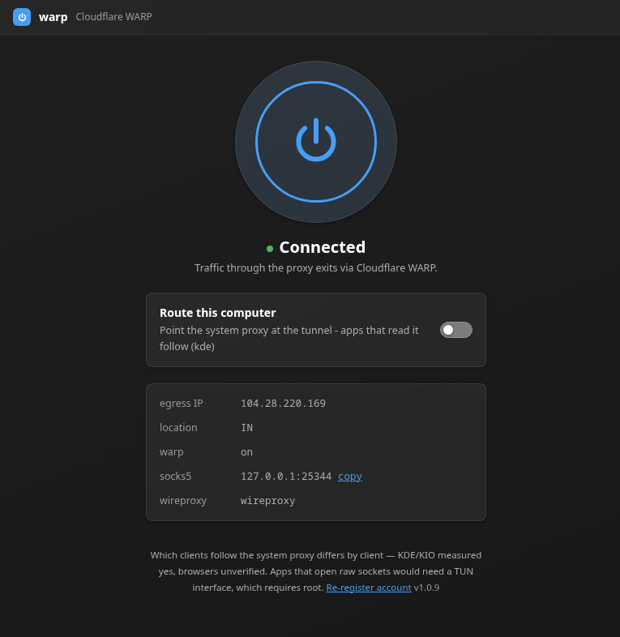
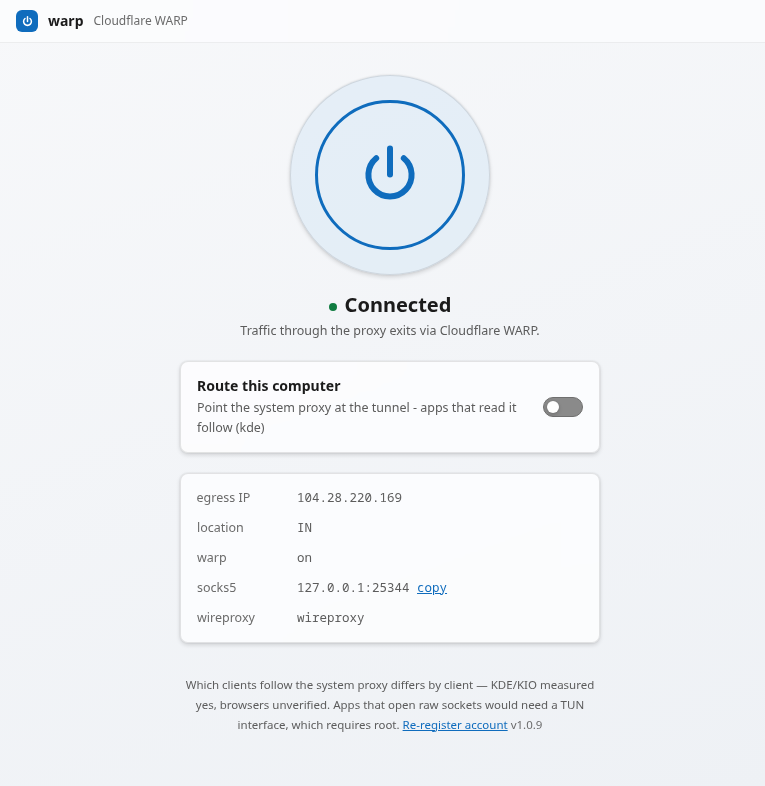

# warp

[](https://github.com/chethan62/warp/actions/workflows/test.yml)

A Cloudflare WARP client in the shape of the 1.1.1.1 app: one page, one big
toggle, your egress IP. Cross-platform, **no root**, **no dependencies** —
stdlib Python only, no npm, no bundler.

```
        ┌─────────┐
        │   ( ⏻ )  │   ← tap to connect
        └─────────┘
          Connected
   egress 104.28.220.169 · warp on
```

<p>
  
  
</p>

The window follows the system theme — both are the real UI, captured from a live
connection.

## Install

Linux:

```sh
curl -fsSL https://github.com/chethan62/warp/releases/latest/download/warp-linux-x86_64.tar.gz \
  | tar -xz -C ~/.local --strip-components=1
```

That is the whole install: a plain tree with a bundled Python, no root, and no
**FUSE** — nothing is mounted. `warp` lands in `~/.local/bin` with a desktop
entry beside it. Re-running that same command updates an existing install —
it overwrites the tree, so there is nothing to uninstall first.

An AppImage is attached to each release as well, and it no longer needs FUSE
either: it is built with [uruntime](https://github.com/VHSgunzo/uruntime), which
mounts the image where FUSE is available and **extracts and runs it where it is
not** — so `libfuse2` missing (the default on Ubuntu) is no longer fatal. It is
still the second choice only because the tarball is one line and involves no
runtime at all.

Windows (PowerShell):

```powershell
irm https://raw.githubusercontent.com/chethan62/warp/main/packaging/install.ps1 | iex
```

Both are user-level — no admin, nothing system-wide — and both finish by running
the app once, so a silent failure is not a possible outcome. They put `warp` on
your PATH with a desktop / Start Menu entry.

Linux installs the self-contained AppImage, so nothing else is needed. Windows
installs from source and needs **Python 3.9+**; with none present it prints the
`winget install Python.Python.3.12` line instead of failing quietly.

Or install from source on any platform:

```sh
pipx install git+https://github.com/chethan62/warp
```

## Why userspace

The official client (`warp-cli`) and an in-kernel WireGuard interface both need
root — the daemon runs as a system service and `wg-quick up` needs
`CAP_NET_ADMIN`. A **userspace** WireGuard client ([wireproxy]) exposes the same
tunnel as a local SOCKS5 listener, which any user can start. That is the whole
trick: real WARP, no privileges.

Registration is one HTTP call to Cloudflare's client API. The WireGuard key pair
is generated locally (pure-Python X25519, checked against the RFC 7748 vectors),
so only the public half ever leaves the machine.

## Requirements

| | |
|---|---|
| Python | 3.9+ (`python3 -m warp`) |
| wireproxy | **obtained automatically** — the app downloads the right release for your OS/arch on first connect, into its own config dir. A copy already on `PATH` is used in preference. |
| root / admin | **not required**, on any platform |

Pin a different wireproxy with `WARP_WIREPROXY_VERSION=1.1.3`.

## Platforms

| Platform | Status | How the tunnel binary is obtained |
|---|---|---|
| Linux | works — AppImage (bundled Python) or source | automatic; upstream publishes 8 linux arches |
| Windows | works — source / `pipx`; CI runs the suite there | automatic (386/amd64; on ARM64 the amd64 build runs under emulation) |
| macOS | works — source / `pipx`; CI runs the suite there | automatic (amd64/arm64) |
| FreeBSD | works **if wireproxy is installed** | `pkg install wireproxy` — upstream publishes no BSD binary |
| other BSD | expected, but unverified | `go install github.com/pufferffish/wireproxy/cmd/wireproxy@v1.1.3` |

The tunnel is `wireproxy`, and upstream publishes **darwin, linux and windows
only** (checked against the v1.1.3 release). Where there is no published binary,
warp uses whatever `wireproxy` is already on `PATH` — that lookup is why a
single `pkg install wireproxy` is the whole FreeBSD setup.

There is no bundled-Python artifact for BSD: python-build-standalone publishes no
BSD target, so a BSD runs warp from source against the system `python3` (all three
BSD package one). The AppImage is Linux-only by construction.

## Run

```sh
python3 -m warp            # serves the UI and opens it in its own window
python3 -m warp up         # connect (registers on first run)
python3 -m warp down       # disconnect
python3 -m warp status     # JSON: running, connected, egress ip, warp state
python3 -m warp route on   # route this computer (system proxy)
python3 -m warp route off  # stop routing this computer
python3 -m warp selftest   # X25519 vectors
```

Flags (before or after the subcommand): `--port`, `--socks-port`, `--no-browser`, `--tab`.

### Window

`warp ui` opens the UI as its own chromeless window rather than a browser tab: it
drives the browser's application mode (`--app=`) with `--class=warp`, so the
desktop gives it warp's own identity and taskbar entry. Nothing extra is
installed — the browser is already there, and `--tab` asks for a plain tab.

That needs a Chromium-family browser. A **Flatpak** one counts
(`flatpak run com.google.Chrome`) and is easy to miss, since it has no `PATH`
entry at all; its profile goes under `~/.var/app/<id>/config/`, because a
Flatpak sandbox cannot see `~/.config`. Firefox is not a candidate — it has no
chromeless app-window mode, so the honest outcome there is a tab.

Or install it as a command:

```sh
pipx install .             # then: warp
```

## AppImage

`dist/warp-1.0.0-x86_64.AppImage` (~27 MB) — self-contained, no system Python
needed, no install step:

```sh
./warp-1.0.0-x86_64.AppImage            # UI
./warp-1.0.0-x86_64.AppImage status     # every subcommand works
./warp-1.0.0-x86_64.AppImage up         # connect
```

Anything passed to the AppImage goes straight through to `python3 -m warp`, and
its state lives in the usual per-user config dir — not inside the image.

Build it yourself (needs `appimagetool` and `rsvg-convert`):

One build emits both Linux artifacts — the AppImage (with the uruntime runtime,
so it launches with or without FUSE) and the tarball:

```sh
./packaging/build-linux.sh --with-python    # fetches a Python, trims it, bundles it
./packaging/build-linux.sh                  # launcher-style: needs host python3
PYTHON_BUNDLE=/opt/python3 ./packaging/build-linux.sh   # bring your own
```

`--with-python` pulls a python-build-standalone release, drops what a CLI never
touches (pip, idle, tk, tests, headers), and bundles the rest — a 404 MB debug
tree becomes ~27 MB of AppImage.  `packaging/publish-release.py`
(needs `GH_TOKEN`) publishes the built image as a GitHub release. The AppRun clears the `PYTHONHOME` that the
AppImage runtime injects pointing at its own mount, which would otherwise kill
the bundled interpreter on startup.

## How it works

```
UI (127.0.0.1:8787)  ──▶  Tunnel  ──▶  wireproxy  ──▶  Cloudflare WARP
   Fluent page            status         SOCKS5          (WireGuard)
                          + reports     127.0.0.1:25344
```

`status` is not a guess: it makes a request through the tunnel to Cloudflare's
own `cdn-cgi/trace` and reports the address and `warp=off|on` it answers with.
If the tunnel is up but Cloudflare says `warp=off`, the UI says so.

## Routing

**Whole computer** — the "Route this computer" switch (or `warp route on`) sets the
operating system's proxy to this tunnel, so every proxy-aware app follows it:
browsers, app stores, most GUI toolkits.

| Platform | Mechanism |
|---|---|
| Linux / KDE | `kwriteconfig6` → `kioslaverc`; `httpProxy=socks://…` is KDE's all-protocol form |
| Linux / GNOME | `gsettings` → `org.gnome.system.proxy` |
| macOS | `networksetup -setwebproxy` / `-setsocksfirewallproxy` |
| Windows | `reg` → `HKCU\\...\\Internet Settings` (WinINET) |

All per-user, no elevation. Stopping the tunnel clears the setting automatically,
so the machine is never left pointing at a dead proxy.

**One app** — point a single tool at the SOCKS5 listener:

```sh
curl --socks5-hostname 127.0.0.1:25344 https://example.com
ALL_PROXY=socks5h://127.0.0.1:25344 <command>
```

Only SOCKS5 is served. wireproxy's `[http]` section *binds* a port but never
answers it — measured 0/3 requests answered versus 3/3 on SOCKS5 — so offering
it meant pointing the OS at a dead listener. Every platform backend can drive
SOCKS, so one listener covers them all.

Apps that open raw sockets rather than honouring a proxy would need a TUN
interface, which does require root — that is the one thing a userspace tunnel
cannot do, and the UI says so rather than implying otherwise.

## DNS — what this does NOT do

DNS is **not** rerouted. A proxy setting is not a routing table: it only affects
apps that speak HTTP or SOCKS, and DNS lookups are neither. Measured on a machine
whose resolver is a local service on `127.0.0.1:53` — turning routing on changed
only the desktop's proxy keys while `/etc/resolv.conf` and `resolvectl status`
stayed exactly as they were, so every lookup still leaves via the original
resolver.

The 1.1.1.1 client *does* reroute DNS because it installs a **TUN device** that
captures every IP packet, UDP/53 included, so DNS rides the tunnel by
construction. Creating a TUN interface needs root — the same privilege boundary
as everything else here.

No `DNS =` line is written into the tunnel config for exactly this reason: it
would be inert, and implying otherwise is worse than saying nothing.

Without root you can still do this much:

| Scope | How |
|---|---|
| Browsers | enable DNS-over-HTTPS (`https://cloudflare-dns.com/dns-query`) — per browser |
| CLI tools | `socks5h://` / `--socks5-hostname` hands the hostname to the proxy, so that name is resolved inside the tunnel |
| Whole system | point the system resolver at the tunnel — needs root (`/etc/resolv.conf`, `systemd-resolved`, or the local resolver's upstream) |

One partial exception worth knowing: **SOCKS5 with remote DNS** (`socks5h://`,
`--socks5-hostname`) hands the *hostname* to the proxy rather than resolving it
locally, so that name is resolved inside the tunnel. Every other lookup — and
every app that resolves names itself — still goes to the original resolver.

### Doing it

```sh
warp dns            # your resolver chain, plus the exact commands for it
warp dns serve      # the DoH-over-tunnel bridge on 127.0.0.1:5053
```

`warp dns` reads the *actual* chain on the machine — `/etc/resolv.conf`, which
resolver daemon owns port 53, and that daemon's upstream — and prints the
commands for that chain, backing the config up first and including the undo
line. Nothing is elevated automatically; the printed `sudo` lines are for you.

Verified end-to-end: `dig @127.0.0.1 -p 5053 example.com` resolves while the
tunnel is up, and answers **SERVFAIL** the moment the tunnel stops — while the
machine's normal resolver keeps working. That contrast is what shows the DNS
really rides the tunnel instead of going direct.

The rest of the ceiling — why the next step up is `CAP_NET_ADMIN` rather than
root, the routing loop a TUN still has to solve, and what is genuinely not
possible without privilege — is researched and cited in
[docs/limits-and-options.md](docs/limits-and-options.md).

## Layout

| File | Role |
|---|---|
| `warp/paths.py` | the only module that knows about directories (APPDATA / Application Support / XDG) |
| `warp/x25519.py` | RFC 7748 scalarmult + key generation (stdlib) |
| `warp/cloudflare.py` | account registration + wireproxy config |
| `warp/provision.py` | downloads the right wireproxy release for this OS/arch |
| `warp/sysproxy.py` | per-OS system proxy apply/clear/status |
| `warp/dnsproxy.py` | DoH-over-SOCKS bridge (UDP in, HTTPS out) |
| `warp/dns.py` | detects the resolver chain, prints the root plan |
| `warp/netprobe.py` | SOCKS5 CONNECT client + egress facts |
| `warp/tunnel.py` | wireproxy lifecycle (start/stop/status) |
| `warp/webui.py` | HTTP API + UI host |
| `warp/window.py` | opens the UI as its own window (browser app mode) |
| `warp/ui/index.html` | the Fluent UI |
| `tests/test_warp.py` | runnable checks (no pytest needed) |
| `packaging/` | Linux builds (AppImage + tarball), release upload, canary |
| `docs/limits-and-options.md` | the ceiling, researched and cited |

## State

`account.json` and `wireproxy.conf` (mode 0600) live in the platform config dir —
`%APPDATA%\warp`, `~/Library/Application Support/warp`, or `~/.config/warp`.
Delete them, or use the UI's *Re-register account*, to start over.

[wireproxy]: https://github.com/pufferffish/wireproxy

## Credits

- **[wireproxy](https://github.com/pufferffish/wireproxy)** (MIT) — the userspace
  WireGuard client this app drives. It is fetched at run time from its own
  releases, never vendored, and none of its code is included here.
- **Cloudflare** — WARP itself, and the public endpoints used: the client
  registration API, `cloudflare-dns.com` for DNS-over-HTTPS, and
  `cloudflare.com/cdn-cgi/trace` for the egress check.
- **RFC 7748** — the X25519 specification. `warp/x25519.py` follows its
  reference implementation and is checked against the published test vectors
  (and against `wg pubkey`, byte for byte).

The project started as an attempt to lift the WARP/proxy module out of
[Tatakai](https://github.com/Snozxyx/Tatakai) (MPL-2.0). That prototype is **not**
in this repo — the code here was written from scratch, so no MPL-2.0 obligation
attaches. The acknowledgement is for the idea, not the code.

Not affiliated with Cloudflare, Inc. "Cloudflare" and "WARP" are trademarks of
Cloudflare, Inc., used only to describe what this software talks to.

## Licence

MIT — see [LICENSE](LICENSE).

Nothing copyleft ships: the source is stdlib-only Python, `wireproxy` is MIT and
is downloaded by the user's machine rather than redistributed here.
